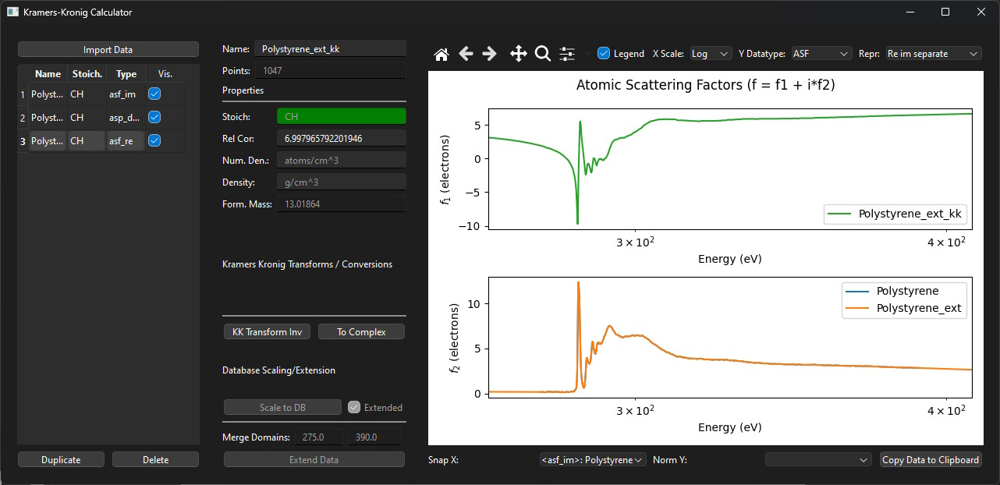

# KKcalc
## Introduction
`kkcalc` is an open-source program to calculate the (inverse) Kramers-Kronig transform of X-ray absorption (dispersion) data,

$$f_2 (E) = \frac{2}{\pi} P \int_{0}^{\infty}\frac{x f_1(x)}{x^2 - E^2} dx + \mathcal{Z}^\star$$

 using a polynomial representation algorithm developed by Watts^[[1](#1)] implemented in `python`.

Documentation with quick-start and examples is located at [url_link](), or can be [built](#docbuild) for offline.

The program can be used via the object-oriented Python API, or through a PyQT6 GUI interface.

Cite us here [[1]](#1).

## Features

###### Extend and Scale
Scale and extend your NEXAFS data by the Henke^[] and Briggs/Lighthill^[] atomic scattering factor databases, for more accurate transforms.
###### Relativistic Correction
Use your material composition to automatically calculate the relativistic correction, $f^0$.
###### GUI Interface
No programming? No problem! Download the executable version.

###### Contrast Calculations
Can calculate the relative contrast between materials in a mix.

## Installation

<!-- KKcalc is a program to calculate the real part of the refractive index of a material in the X-ray region of the spectrum from measured absorption data via the Kramers-Kronig transform using an algorithm developed by Watts [WATTS2014]_. KKcalc boasts the following features:

- Easily extend measured spectra with published scattering factors.
- Efficient peicewise polynomial (direct integration) algorithm for Kramers-Kronig transform.
- Automatic calculation of the relativistic correction.
- Python source code is easy to read, so you can assess its correctness yourself.
- Freely available on a wide range of platforms.
- Graphical interface for easy use.

For support, please contact benjamin.watts@gmail.com

The major emphasis of this program is to provide **correct** results. I would be glad to be informed of any problems.
Please consider citing the article [WATTS2014]_ when publishing work that utilises this calculation.

PYPI Installation
-----------------

`KKcalc <https://pypi.org/project/kkcalc/>`_ is included in the `PyPI <https://pypi.org/>`_ package management system. To automatically install KKcalc together with all the modules it depends on, simply run the command::

    pip install kkcalc

Further details about pip usage can be found in the `PyPI installation tutorial <https://packaging.python.org/tutorials/installing-packages/>`_

Manual Installation
-------------------
Download the software (e.g. as a zip file). The zip file contains::

    kk.py
    kk_gui.py
    data.py
    test_kk.py
    PackRawData.py
    ASF.json
    LICENSE.txt
    README.rst
    asf/
        elements.dat
        h.nff
        he.nff
        ...
        u.nff

You will also need to install the following dependencies:

- Python_
- Numpy_ (Numerical Python)
- Scipy_ (Scientific Python) - optional package, needed only for the "fix distortions" option
- wxPython_ - optional package, needed only for the graphical user interface

.. _Python: http://www.python.org/
.. _Numpy: http://numpy.scipy.org/
.. _Scipy: http://scipy.org/
.. _wxPython: http://wxpython.org/

Basic Usage
===========

1. Start program by running `python kk_gui.py`
2. Load NEXAFS data from file by selecting: File>Load. Data is converted to atomic scattering factors and plotted upon successful loading.
3. Check that the selection box knows the type of the raw data, so that it is being converted to scattering factors correctly.
4. Enter molecular formula in the "Material" section.
5. Click on the "Calculate" button. The new real scattering factors are plotted upon completion of the Kramers-Kronig transform calculation (should only take a second, idepending on the number of data points and computing power).
6. Save data by selecting: File>Save.

For more advanced usage and scripting, check out the functions provided in the kk.py module.

Developement
------------
If you're interested in modifying the `KKcalc` library or contributing to it's future development, you can install an editable version of the code via `git`/github.

Using a terminal, 

    git clone https://github.com/<your-username>/kkcalc

Next, install the pre-commit 

"Near-Edge Data" Section
------------------------

Here we define a detailed section of the imaginary spectrum to be inputted into the Kramers-Kronig transform. The "File:" label simply displays the currently loaded data file. To load a new set of near-edge absorption data, select: *File>Load*. Data files must be in columns, the first giving the photon energy in electron volts and the last column giving the absorption spectrum data.

The two text-boxes in the next row, initially containing "Start" and "End" control the energy points between which the loaded data will be used. Valid entries in these controls include energy values and the strings "Start" or "End", which are understood by the program to correspond to the lowest and highest energy points, respectively, in the loaded data set.

There are two further options seen as checkboxes at the bottom of the "Near-Edge Data" section of the GUI. The "Add background" checkbox is for replacing the background (by extrapolating the pre-edge region) that may have been subtracted from the user-supplied data. This function has not been reimplemented to work with the internal data format currently used by KKcalc and the checkbox is disabled. The "Fix distortions" option (whose checkbos is disabled if the program fails to load the Scipy module) will skew the data to fit the slope of the scattering factor data. This is useful for working with data recorded using detectors with an uncalibrated energy dependence. The detector energy dependence is assumed to be approximately linear (which should hold fairly well over a short energy range) and the scattering factors may not be a good reference to fit the data to, so the use of this option is definitely not encouraged (it is always better to understand and properly normalise your data before loading into KKcalc).

"Material" Section
------------------

In this section, we define the material whose optical properties are being investigated. The first textbox is for the density of the material - a value here is only needed in converting data between scattering factors and Beta (the absorption part of the refractive index). This value will have no effect unless you are working with data loaded or saved as Beta. The second textbox is for entering the elemental composition of the material. This will be plotted and used to calculate the appropriate scattering factors to extend the user-supplied near-edge imaginary spectrum as well as to calculate the relativistic correction to the Kramers-Kronig transform.

"Calculation" Section
---------------------

KKcalc implements a piecewise polynomial algorithm that performs direct integration of the area between the data-points. [WATTS2014]_ User-supplied data and the scattering factor below 30,000 eV [HENKE1993]_ is interpolated linearly, while the high energy scattering factor data is described by Laurent polynomials [BIGGS1988]_ (the scattering factor data is assembled as described by Henke et al. [HENKE1993]_). Using this piecewise-polynomial expression of the imaginary spectrum, the symbolic form of the Kramers-Kronig transform integral is precisely known and can be fully written symbolically (albeit piecewise). This form is then trivial (though tedious) to symbolically integrate in a piecewise fashion everywhere except at the singularity, which is avoided by integrating across two intervals at once (terms referencing the singularity cancel out). The only assumption of this method is that the piecewise-polynomial description of the imaginary spectrum is continuous (which is required by physics), all remaining steps are exact to machine precision. This algorithm is very efficient because it doesn't require equally spaced steps, which would correspond to a very large number of samples over the full energy range of the spectrum.

The calculation of the relativistic correction deserves some mention too, since I have seen a number of programs not calculating it correctly. Information on the types and number of atoms present are taken from the "Material" box and the equation :math:`Z - (\frac{Z}{82.5})^{2.37}` (as described by Henke et al. [HENKE1993]_) is applied to each atom separately and the individual corrections then summed. -->

#### Usage

###### GUI

`KKCalc` has a modularised GUI interface that can be used without  

###### Python

`kkcalc` is an object-oriented, typed library. If you are keen to include `kkcalc` into your own `python` scripts, use a modern code editor that can intepret docstrings, such as VSCode or PyCharm to get hints as you code.

#### Contributing & Developement
Want to contribute? Great! Create an issue on Github to discuss.

To install for development, clone the repository into your local file system using `Github Desktop` or `Git` via Windows Terminal / CMD.

    git clone https://github.com/benajamin/kkcalc

  or (even better) create your own fork/branch of `kkcalc` on `github` so you can save and contribute your own changes, and clone that to your local file system.

    git clone https://github.com/<myusername>/kkcalc

  Change directory to the repository, and install an editable version of the repository to your system or a virtual environment, so modifications will be reflected upon `kkcalc` import.

    pip install . -e

  `kkcalc` uses a combination of continuous integration (CI) tools to manage the code quality and documentation. Install these hooks by ....

#### Documentation 
To build the documentation, install the documentation dependencies:

    pip install .[docs]
    
To build the documentation, run

    cd docs
    make html

which should create a new set of static `HTML` files in the `/docs/_build` directory. 

To update the documentation after edits, run:

    sphinx-apidoc -o ./docs ./kkcalc

in the source directory, then rebuild as above.

## References

<a id=1>[1]</a> Benjamin Watts, "Calculation of the Kramers-Kronig transform of X-ray spectra by a piecewise Laurent polynomial method", *Opt. Express* **22**, (2014) 23628-23639. [`DOI:10.1364/OE.22.023628`](https://doi.org/10.1364/OE.22.023628)

<a id=1>[2]</a> B.L. Henke, E.M. Gullikson, and J.C. Davis, "X-ray interactions: photoabsorption, scattering, transmission, and reflection at E=50-30000 eV, Z=1-92", *Atomic Data and Nuclear Data Tables* **54** (2) (1993) 181-342 [`DOI:10.1006/adnd.1993.1013`](https://doi.org/10.1006/adnd.1993.1013).

<a id=1>[3]</a> F. Biggs, and R. Lighthill, "Analytical approximations for X-ray cross-sections III", *Sandia Report* SAND87-0070 UC-34 (1988). [`DOI:10.2172/7124946`](https://doi.org/10.2172/7124946)

